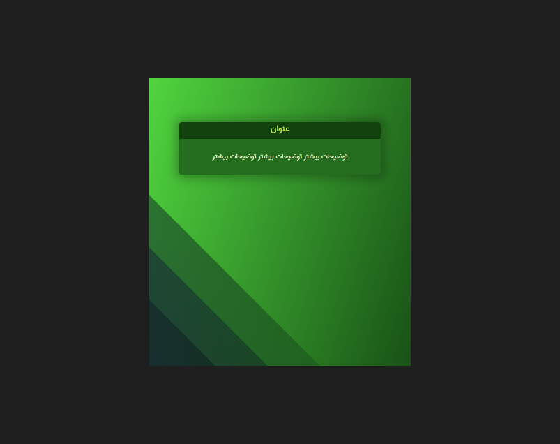

# Geometric Hero Banner

This project is my first challenge in working with geometric shapes and layer management in CSS.

## 🎯 Project Objectives
- Practice `position: absolute` and `position: relative` to control layout.
- Using `transform` (rotate and scale) to create diagonal polygons.
- Managing `overflow: hidden` to clip elements within a container.

## 📸 Preview

## 💡 Key Learnings
In this project, I learned how to handle CSS `transform` conflicts and correctly set the positioning context to keep elements inside the container.