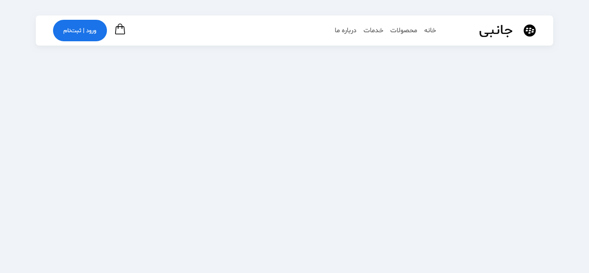

# Responsive Navigation Bar

This project focuses on building a clean, modern, and fully responsive navigation bar using pure HTML and CSS.

## 🎯 Project Objectives
- Build a semantic HTML structure for site navigation.
- Utilize CSS Flexbox to perfectly align the brand logo, navigation links, and call-to-action buttons.
- Implement responsive design using CSS `@media` queries to ensure the navbar adapts seamlessly across multiple screen sizes (from desktop down to 368px).

## 📸 Preview

## 💡 Key Learnings
In this project, I strengthened my skills in responsive web design. I learned how to effectively use multiple breakpoints, scale down fonts and spacing dynamically, and manage the conditional display of UI elements (such as swapping a large login button for a compact one on mobile devices) to maintain a great user experience on any device.