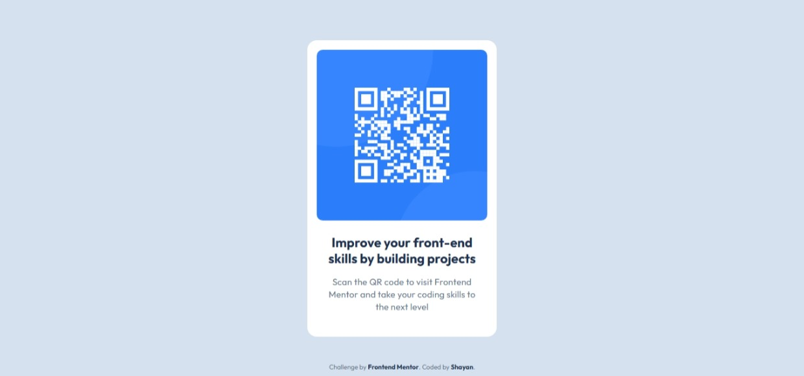

# Frontend Mentor - QR code component solution

This is a solution to the [QR code component challenge on Frontend Mentor](https://www.frontendmentor.io/challenges/qr-code-component-iux_sIO_H). Frontend Mentor challenges help you improve your coding skills by building realistic projects. 

## Table of contents

- [Overview](#overview)
  - [Screenshot](#screenshot)
  - [Links](#links)
- [My process](#my-process)
  - [Built with](#built-with)
  - [What I learned](#what-i-learned)

## Overview

### Screenshot



### Links

- Solution URL: [[Add your Frontend Mentor solution URL here](https://www.frontendmentor.io/solutions/responsive-qr-code-component-with-css-flexbox-hieq3IAorO)]
- Live Site URL: [[Add your GitHub Pages live URL here](https://shayanfa76.github.io/frontend-learning-journey/01-HTML-CSS-Basic/004-QR-Code-Component/)]

## My process

### Built with

- Semantic HTML5 markup
- CSS custom properties
- Flexbox

### What I learned

In this project, I strengthened my CSS layout skills by learning how to perfectly center a component on the screen using CSS Flexbox on the `body` tag:

```css
body {
    min-height: 100vh;
    display: flex;
    justify-content: center;
    align-items: center;
}

I also encountered a common Box Model challenge with border-radius on images. I learned that adding padding directly to an image pushes the content inward, making the border-radius applied to the transparent padding area rather than the image itself. To fix this, I applied the padding to the parent .container and gave the image a width: 100%, allowing the border-radius to apply smoothly to the image corners.