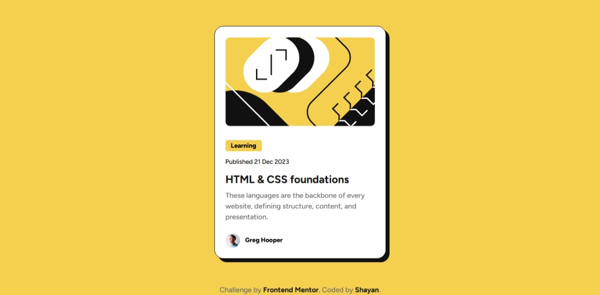

# Frontend Mentor - Blog preview card solution

This is a solution to the [Blog preview card challenge on Frontend Mentor](https://www.frontendmentor.io/challenges/blog-preview-card-ckPaj01IcS). Frontend Mentor challenges help you improve your coding skills by building realistic projects. 

## Table of contents

- [Overview](#overview)
  - [The challenge](#the-challenge)
  - [Screenshot](#screenshot)
  - [Links](#links)
- [My process](#my-process)
  - [Built with](#built-with)
  - [What I learned](#what-i-learned)
  - [Continued development](#continued-development)
  - [AI Collaboration](#ai-collaboration)
- [Author](#author)

## Overview

### The challenge

Users should be able to:

- See hover and focus states for all interactive elements on the page

### Screenshot




### Links

- Solution URL: [[[Add your GitHub repository URL here](https://www.frontendmentor.io/solutions/responsive-blog-card-WzXRajvnwJ)]]
- Live Site URL: [[[Add your live site URL here (e.g., GitHub Pages)](https://shayanfa76.github.io/blog-preview-card/)]]

## My process

### Built with

- Semantic HTML5 markup
- CSS custom properties
- Flexbox
- Mobile-first workflow
- Neo-brutalism design style

### What I learned

Working on this challenge was a great opportunity to refine my understanding of clean, semantic coding and exact design translations. Some of the major highlights include:

**1. Semantic HTML:** I learned how to use the `<time>` tag instead of a simple `<p>` for publishing dates to improve accessibility and SEO.

**2. Neo-brutalism Shadows:** I discovered that setting the blur radius to `0` in `box-shadow` creates the sharp, solid shadows characteristic of the Neo-brutalism design style.
```css
.blog-card {
    box-shadow: 8px 8px 0px #111111; /* 0px blur for sharp edges */
}

3. DRY CSS Principles: I optimized my media queries by removing repetitive code, relying on the cascading nature of CSS to inherit styles like padding and border-radius from the default desktop styles.

4. Smooth Transitions: Added smooth color transitions to interactive elements for a better User Experience.

.title a {
    transition: color 0.3s ease;
}
.title a:hover {
    color: #f4d04e;
}