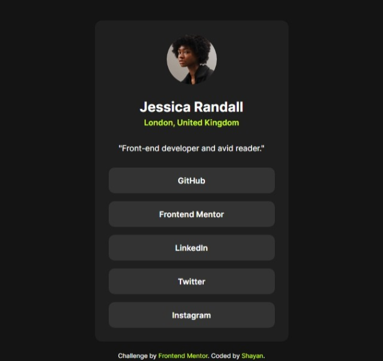

# Frontend Mentor - Social links profile solution

This is a solution to the [Social links profile challenge on Frontend Mentor](https://www.frontendmentor.io/challenges/social-links-profile-UG32l9m6dQ). Frontend Mentor challenges help you improve your coding skills by building realistic projects. 

## Table of contents

- [Overview](#overview)
  - [The challenge](#the-challenge)
  - [Screenshot](#screenshot)
  - [Links](#links)
- [My process](#my-process)
  - [Built with](#built-with)
  - [What I learned](#what-i-learned)
  - [Continued development](#continued-development)
- [Author](#author)

## Overview

### The challenge

Users should be able to:

- See hover and focus states for all interactive elements on the page
- View the optimal layout for the interface depending on their device's screen size

### Screenshot



*(Note: Add your project screenshot in the root folder and name it screenshot.jpg)*

### Links

- Solution URL: [Click here to view my solution](https://www.frontendmentor.io/solutions/social-links-profile-hfczCSeZVM)
- Live Site URL: [Click here to view the live site](https://marvelous-medovik-c7c181.netlify.app/)

## My process

### Built with

- Semantic HTML5 markup
- CSS custom properties (Variables)
- Flexbox
- Mobile-first workflow
- Web Accessibility best practices (Focus states & descriptive alt attributes)

### What I learned

During this project, I significantly improved my understanding of semantic HTML and CSS component structuring. One of my major learnings was properly formatting interactive lists. Instead of placing anchor tags inside heading tags, I learned to use standard `<ul>` and `<li>` structures, applying the styling directly to the `<a>` tag and setting it to `display: block`. This ensures the entire button area is clickable, providing a much better User Experience (UX).

I also focused heavily on accessibility, ensuring that interactive elements are not only styled for mouse hover states but also for keyboard navigation using `:focus`:

```css
.btn-link:hover,
.btn-link:focus {
    background-color: var(--green);
    color: var(--grey-900);
    outline: none;
}